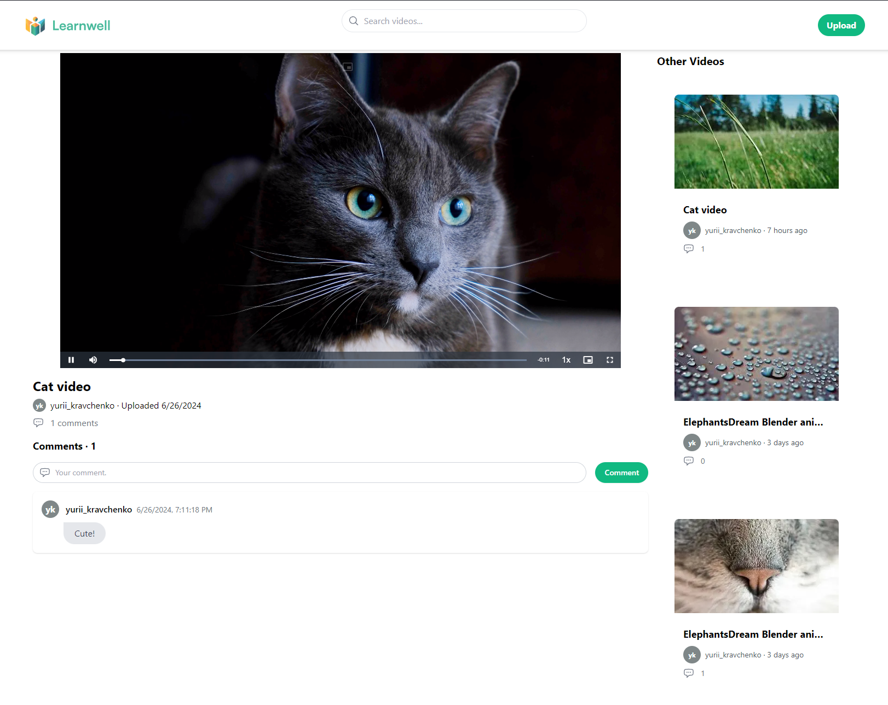

# LearnWell Video Player

## App Functionality: The website have the following capabilities:

-- Show a list of videos and allow users to select a video from the list.

-- Allow the user to create a new video object with a title, description and a video URL.

-- A user must be able to comment on a video and view comments from other users.

-- Open the videos in full screen with full playback functionality.

-- Include options for adjusting playback speed and volume.

## Getting Started

```
npm run dev

or
yarn dev

or
pnpm dev

or
bun dev
```

Open [http://localhost:3000](http://localhost:3000) with your browser to see the result.


## API Integration

This application consumes the following API: https://take-home-assessment-423502.uc.r.appspot.com/docs#/

- **User ID**: Use your first and last name in snake case as your `user_id` for creating video objects (e.g., John
  Smith: john_smith).
- **Comments**: Use any fake `user_id` for making comments.
- **Video URLs**: Upload example video URLs for testing.
## Main page


## Upload
 

## Video player and comments


